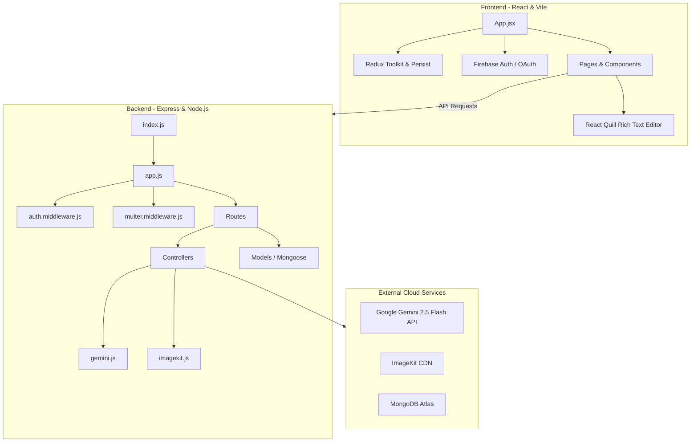

# 🚀 NeoBlog - Full Stack AI-Powered Blogging Application

NeoBlog is a state-of-the-art, full-stack, AI-powered blogging platform built on the MERN (MongoDB, Express, React, Node.js) stack. It integrates advanced features such as Google Gemini AI-driven article content generation, Firebase social authentication, cloud storage with ImageKit, rich-text WYSIWYG editing, a responsive dashboard, and comments moderations.

---

## 🛠️ Technology Architecture

NeoBlog follows a clean client-server architecture, separation of concerns, and robust state persistence.



### Frontend Stack
*   **Core:** React 18, Vite (Fast build tool)
*   **State Management:** Redux Toolkit (global state), Redux Persist (local storage state persistence)
*   **Styling:** TailwindCSS, Flowbite React UI component framework
*   **Interactions & Animations:** Motion (Framer Motion), React Icons, Lucide React
*   **Rich Text Editor:** React Quill (WYSIWYG editor)
*   **Utilities:** Axios (API client), Moment.js (Date formatting), HTML Truncate (Snippets)

### Backend Stack
*   **Runtime & Framework:** Node.js, Express.js
*   **Database:** MongoDB Atlas with Mongoose ORM
*   **Authentication & Security:** JSON Web Token (JWT) with HTTP-only cookies, BcryptJS for password hashing
*   **File Uploads:** Multer (multipart middleware), ImageKit Node SDK (Cloud CDN upload)
*   **AI Integration:** Google GenAI SDK (Gemini 2.5 Flash)

---

## 📂 Project Directory Mapping

Here is the structural mapping of the codebase showing the purpose of each directory and file.

### 📁 Root Directory
*   [package.json](file:///C:/BlogApp/package.json) - Contains root workspace scripts to concurrently run/build backend and frontend.

### 📁 Backend Codebase `(/backend)`
*   [backend/index.js](file:///C:/BlogApp/backend/index.js) - Entry point for the Node.js server. Connects to database and mounts static frontend client build.
*   [backend/app.js](file:///C:/BlogApp/backend/app.js) - Initializes Express app, configures global middleware (CORS, JSON, cookieParser), and registers API route groups.
*   [backend/constant.js](file:///C:/BlogApp/backend/constant.js) - Declares backend system constants (e.g. database name `NeoBlog`).
*   **[backend/db/](file:///C:/BlogApp/backend/db/)**
    *   [db.js](file:///C:/BlogApp/backend/db/db.js) - Manages the Mongoose connection events and connects server to MongoDB Atlas.
*   **[backend/models/](file:///C:/BlogApp/backend/models/)**
    *   [user.model.js](file:///C:/BlogApp/backend/models/user.model.js) - User Schema detailing credential requirements, profile images, and user roles (`isAdmin`).
    *   [post.model.js](file:///C:/BlogApp/backend/models/post.model.js) - Blog Post Schema holding title, category, description content, image links, and publish state.
    *   [comment.model.js](file:///C:/BlogApp/backend/models/comment.model.js) - Comment Schema supporting replies, nested relationships, approvals (`isApproved`), and like counts.
*   **[backend/routes/](file:///C:/BlogApp/backend/routes/)**
    *   [auth.route.js](file:///C:/BlogApp/backend/routes/auth.route.js) - Signup, Login, and Google OAuth endpoints.
    *   [user.router.js](file:///C:/BlogApp/backend/routes/user.router.js) - Profile update, single user fetch, user list (Admin), and delete routes.
    *   [post.router.js](file:///C:/BlogApp/backend/routes/post.router.js) - Blog CRUD actions, public query list, and AI generation route.
    *   [comment.route.js](file:///C:/BlogApp/backend/routes/comment.route.js) - Comments CRUD, approvals, likes, and reply pathways.
*   **[backend/controllers/](file:///C:/BlogApp/backend/controllers/)**
    *   [auth.controller.js](file:///C:/BlogApp/backend/controllers/auth.controller.js) - Implements credential creation, token signups, password verification, Google logins, and avatar ImageKit uploads.
    *   [user.controller.js](file:///C:/BlogApp/backend/controllers/user.controller.js) - Implements profile updates, user deletes, logouts, and user lookups.
    *   [post.controller.js](file:///C:/BlogApp/backend/controllers/post.controller.js) - Handles article uploads, updates, image cloud transfers, pagination filters, and Gemini context requests.
    *   [comment.controller.js](file:///C:/BlogApp/backend/controllers/comment.controller.js) - Implements likes toggle, reply nesting, and admin moderation approvals.
*   **[backend/middleware/](file:///C:/BlogApp/backend/middleware/)**
    *   [auth.middleware.js](file:///C:/BlogApp/backend/middleware/auth.middleware.js) - Verifies client credentials using Bearer tokens or Cookies to protect routes.
    *   [multer.middleware.js](file:///C:/BlogApp/backend/middleware/multer.middleware.js) - Local temporary storage configurator for multipart uploads.
*   **[backend/utills/](file:///C:/BlogApp/backend/utills/)**
    *   [gemini.js](file:///C:/BlogApp/backend/utills/gemini.js) - Google Gemini API helper configuring the `gemini-2.5-flash` model.
    *   [imagekit.js](file:///C:/BlogApp/backend/utills/imagekit.js) - Configures connection settings for ImageKit cloud CDN.

### 📁 Frontend Codebase `(/frontend)`
*   [frontend/package.json](file:///C:/BlogApp/frontend/package.json) - Directs client packages, dependencies, and Vite configurations.
*   [frontend/index.html](file:///C:/BlogApp/frontend/index.html) - Base DOM root container.
*   **[frontend/src/](file:///C:/BlogApp/frontend/src/)**
    *   [App.jsx](file:///C:/BlogApp/frontend/src/App.jsx) - Main router path definitions. Integrates public pathways and checks access rights via the `PrivateRoute` wrapper.
    *   [main.jsx](file:///C:/BlogApp/frontend/src/main.jsx) - Mounts the application to the DOM inside Redux store and PersistGate wrappers.
    *   [index.css](file:///C:/BlogApp/frontend/src/index.css) - Implements base styles, scrollbars, fonts, and Tailwind utilities.
    *   [firebase.js](file:///C:/BlogApp/frontend/src/firebase.js) - Instantiates the Firebase configuration for Google OAuth.
    *   **[frontend/src/redux/](file:///C:/BlogApp/frontend/src/redux/)**
        *   [store.js](file:///C:/BlogApp/frontend/src/redux/store.js) - Combines theme and user reducers, setting up local storage state persistence.
    *   **[frontend/src/components/](file:///C:/BlogApp/frontend/src/components/)**
        *   [Navbar.jsx](file:///C:/BlogApp/frontend/src/components/Navbar.jsx) - Main header containing theme toggle, profile dropdowns, and auth redirections.
        *   [Header.jsx](file:///C:/BlogApp/frontend/src/components/Header.jsx) - Banner displaying blog branding.
        *   [Bloglist.jsx](file:///C:/BlogApp/frontend/src/components/Bloglist.jsx) - Renders the paginated grid of blogs with search filters.
        *   [CommentSection.jsx](file:///C:/BlogApp/frontend/src/components/CommentSection.jsx) - Handles commenting, reply threads, like toggles, and edit controls.
        *   [Search.jsx](file:///C:/BlogApp/frontend/src/components/Search.jsx) - Advanced filters sidebar querying by keyword, sorting order, and tags.
        *   [ThemeProvider.jsx](file:///C:/BlogApp/frontend/src/components/ThemeProvider.jsx) - Swaps CSS classes based on active state (light/dark) in Redux.
        *   **[frontend/src/components/admin/](file:///C:/BlogApp/frontend/src/components/admin/)**
            *   [Login.jsx](file:///C:/BlogApp/frontend/src/components/admin/Login.jsx) / [Signup.jsx](file:///C:/BlogApp/frontend/src/components/admin/Signup.jsx) - Custom credential panels.
            *   [OAuth.jsx](file:///C:/BlogApp/frontend/src/components/admin/OAuth.jsx) - Triggers Google Pop-up Authenticator and logs users into the backend.
            *   [Sidebar.jsx](file:///C:/BlogApp/frontend/src/components/admin/Sidebar.jsx) - Control panel layout for navigating dashboard tabs.
            *   [BlogTable.jsx](file:///C:/BlogApp/frontend/src/components/admin/BlogTable.jsx) / [CommentTable.jsx](file:///C:/BlogApp/frontend/src/components/admin/CommentTable.jsx) / [UserTable.jsx](file:///C:/BlogApp/frontend/src/components/admin/UserTable.jsx) - Data tables with actions for deletes, edits, or moderation.
    *   **[frontend/src/pages/](file:///C:/BlogApp/frontend/src/pages/)**
        *   [Home.jsx](file:///C:/BlogApp/frontend/src/pages/Home.jsx) - Aggregates Navbar, Header, Blog list, Newsletter, and Footer components.
        *   [Blog.jsx](file:///C:/BlogApp/frontend/src/pages/Blog.jsx) - High-fidelity single blog content view displaying comment sections.
        *   **[frontend/src/pages/admin/](file:///C:/BlogApp/frontend/src/pages/admin/)**
            *   [Dashboard.jsx](file:///C:/BlogApp/frontend/src/pages/admin/Dashboard.jsx) - Aggregates site metrics and tables.
            *   [AddBlog.jsx](file:///C:/BlogApp/frontend/src/pages/admin/AddBlog.jsx) - Blog creation interface featuring the Quill Editor and **AI Content Generator** button.
            *   [UpdateBlog.jsx](file:///C:/BlogApp/frontend/src/pages/admin/UpdateBlog.jsx) - Interface to modify existing blog details.
            *   [Profile.jsx](file:///C:/BlogApp/frontend/src/pages/admin/Profile.jsx) - Settings screen for account edits and avatar uploads.
            *   [Comment.jsx](file:///C:/BlogApp/frontend/src/pages/admin/Comment.jsx) - Review center to approve or reject pending comments.

---

## 👥 Role-Based Functionality Matrix

NeoBlog separates privileges between **Normal Registered Users** and **Administrators** to ensure moderation and secure content creation.

| Functionality | Normal User | Admin User |
| :--- | :---: | :---: |
| **Toggle Light/Dark Theme** | ✅ | ✅ |
| **Browse & Filter Blog Posts** | ✅ | ✅ |
| **Search & Pagination Filtering** | ✅ | ✅ |
| **Create Account & Login (Email / Google OAuth)** | ✅ | ✅ |
| **Edit Profile & Upload Avatar (ImageKit)** | ✅ | ✅ |
| **Write & Submit Comments** | ✅ (Needs Approval) | ✅ (Auto-approved) |
| **Reply to Comments & Like Comments** | ✅ | ✅ |
| **View Visual System Dashboard Statistics** | ❌ | ✅ |
| **Add / Publish New Blog Posts** | ❌ | ✅ |
| **AI Content Generator (Google Gemini Integration)** | ❌ | ✅ |
| **Update & Delete Any Blog Post** | ❌ | ✅ |
| **Moderate & Approve/Reject Comments** | ❌ | ✅ |
| **View, Manage, & Delete Registered Users** | ❌ | ✅ |

---

## ⚙️ Setup and Installation

Follow these steps to run the application locally on your machine.

### 📋 Prerequisites
*   Node.js (v18.0.0 or higher)
*   MongoDB Database (Atlas cluster or local service)
*   ImageKit account (for cloud image storage)
*   Firebase project (for social login/OAuth setup)
*   Google Gemini API Key (for content generator)

### 📥 1. Git Clone and Install Dependencies
Open your terminal and execute:
```bash
# Clone the repository
git clone https://github.com/sohamdas01/NeoBlog.git
cd NeoBlog

# Install root dependencies
npm install

# Install backend dependencies
npm install --prefix backend

# Install frontend dependencies
npm install --prefix frontend
```

### 🔑 2. Configure Environment Variables
Create `.env` files in both backend and frontend directories as shown below.

#### Backend Env Configurations:
Create a file named `.env` inside `backend/` directory:
```env
PORT=8000
MONGODB_URI="your_mongodb_atlas_uri"
JWT_SECRET="your_custom_jwt_secret"

# ImageKit Credentials
IMAGEKIT_PUBLIC_KEY="your_imagekit_public_key"
IMAGEKIT_PRIVATE_KEY="your_imagekit_private_key"
IMAGEKIT_URL_ENDPOINT="your_imagekit_url_endpoint"

# Gemini AI Key
GEMINI_API_KEY="your_google_gemini_api_key"
```

#### Frontend Env Configurations:
Create a file named `.env` inside `frontend/` directory:
```env
VITE_FIREBASE_API_KEY="your_firebase_api_key"

# ImageKit Credentials (Public)
REACT_APP_IMAGEKIT_PUBLIC_KEY="your_imagekit_public_key"
REACT_APP_IMAGEKIT_URL_ENDPOINT="your_imagekit_url_endpoint"
```

### 🚀 3. Run the Application
You can run the frontend and backend simultaneously or independently using commands declared in the root [package.json](file:///C:/BlogApp/package.json):

```bash
# To run both client and server in development mode concurrently:
npm run dev

# Alternatively, run server and client individually:
# Runs backend Node server (on http://localhost:8000)
npm run backend:dev

# Runs frontend Vite development server (on http://localhost:5173)
npm run frontend:dev
```

### 📦 4. Production Build
To create a production-ready optimized build:
```bash
# Build the application
npm run build

# Start server in production mode
npm run start
```
The server is configured in [index.js](file:///C:/BlogApp/backend/index.js) to serve static frontend production builds from `frontend/dist`.

---

## 🎬 Demo & References
*   **Video Walkthrough:** [Watch the Loom Video Demo](https://www.loom.com/share/b923189d8c3649b19ae5dc3753fba56c?sid=1065f511-70de-4003-b82e-300d8a17d67c)
*   **Active Deployment:** [Explore NeoBlog Production App](https://neoblog-mnyz.onrender.com)
